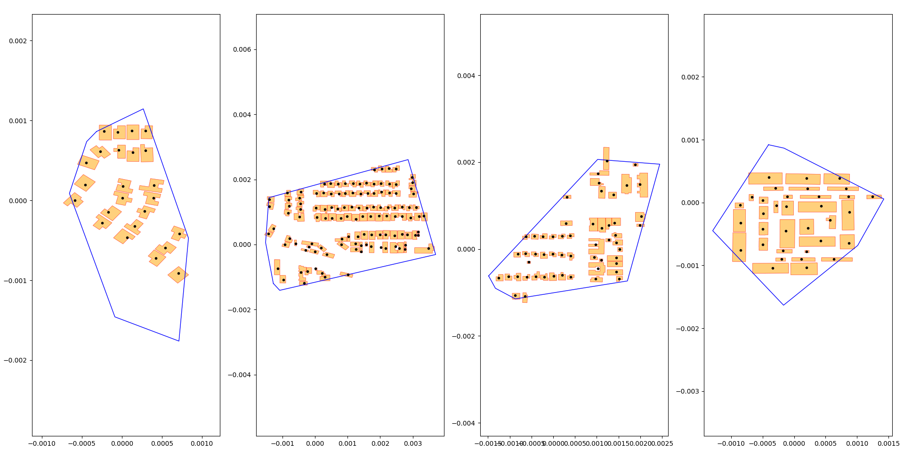
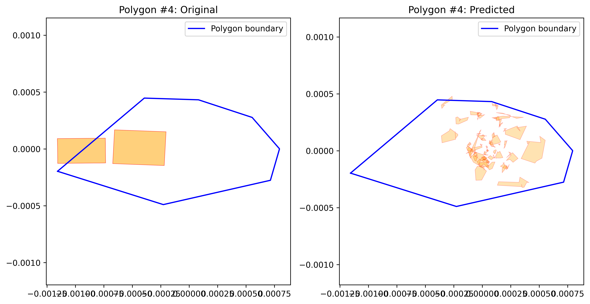

# SmartCity

## Описание

Система генерации застройки.

---

## Шаги для генерации данных для обучения нейросети

### 1. Скачать необходимые данные -- 16.57GB.

```bash
python3 AI_learning_data/download_JSONs_of_corresponding_cities.py
```

В результате в папке **`AI_learning_data/downloaded_JSONs`** появятся все .json-файлики с репозитория [opencitymodel](https://github.com/opencitymodel/opencitymodel), которые есть и в проекте [500 Cities: City Boundaries](https://catalog.data.gov/dataset/500-cities-city-boundaries).
Нужно делать такое "пересечение" данных, так как в opencitymodel нет никакой информации о границах городов. Значит, нужно достать эту информацию с другого ресурса (500 Cities), а затем -- сопоставить 2 источника данных.

### 2. Отфильтровать данные (удалить здания, находящиеся за границами городов)

Так как opencitymodel даёт данные ещё и о тех зданиях, которые находятся в некотором округе города, а не только в самом городе, а нас интересует работа с конкретным городом в конкретных границах, то нужно убрать все лишние здания:

```bash
python3 AI_learning_data/filter_buildings_data.py
```

В результате в той же папке **`AI_learning_data/downloaded_JSONs`** появится подпапка **`filtered`** (9.54 GB)
В ней будут лежать файлы с соответствующей припиской -- **`statename_cityname_statename-002_FILTERED`**, в которых и будут находится данные только о тех зданиях, что лежат внутри границ городов.

### 3. Соединить файлы

Так как изначально в opencitymodel данные об одном городе разбивали на несколько файлов, теперь нужно их соединить в один большой файлик:

```bash
python3 AI_learning_data/combine_filtered_buildings_data.py
```

В результате в папке **`AI_learning_data/downloaded_JSONs/filtered`** появится подпапка **`combined`** (9.79 GB).
В ней будут лежать большие файлы с соответствующей припиской -- **`statename_cityname_COMBINED`**.

### 4. Удалить дублирующиеся данные

Так как в процессе работы данные продублировались несколько раз (сначала файлики просто скачались, затем -- отфильтровались, после чего -- скомбинировались), а нас интересует только финальный результат, то нужно удалить все предыдущие версии и оставить только скомбинированные отфильтрованные файлы:

```bash
python3 AI_learning_data/move_combined_cleanup.py
```

В результате нужные файлы окажутся в папке **`AI_learning_data/city_combined_data`**, а папка **`AI_learning_data/downloaded_JSONs`** будет удалена.

### 5. Разбить город на полигоны

Запустить алгоритм разбиения города на полигоны разных размеров с сохранением получившихся результатов:

```bash
python3 AI_learning_data/split_city_into_polygons.py
```

В результате создастся папка **`AI_learning_data/idk`**, в которой будут лежать нужные данные -- файлы с полигонами для разбиений городов (напр., разбиение города Mobile на полигоны по 10,000 метров -- **`mobile_polygons_10000.json`**). Чтобы сэкономить место, вершины зданий выделены в отдельный файл (напр., **`mobile_vertices.json`**), а информация о геометрии зданий внутри полигонов использует просто индексы на массив в этом файле. Пример нескольких полигонов:



### 6. Сконвертировать данные в унифицированный формат

Наши сформированные данные находятся в формате `EPSG:4979`, но для будущей нейросети неважно, с какой части США был взят тот или иной полигон: важна лишь форма полигона и геометрия зданий внутри него. Поэтому полигоны нужно перенести так, чтобы их центр оказался в точке (0,0):

```bash
python3 convert_training_data_to_xy.py
```

В результате в нашей папке **`AI_learning_data/idk`** файлики получат суффикс **`_converted`**, например, **`mobile_polygons_10000.json`** станет **`mobile_polygons_10000_converted.json`**, а файлики с вершинами (напр., **`mobile_vertices.json`**) удалятся: их информация теперь будет хранится сразу в геометрии зданий полигона без использования индексов, чтобы в обучающем нейросеть скрипте не производить это "доставание".

## Шаги для обучения нейросети

### 0. Выбрать часть данных

Так как подготовленные данные (вся папка **`AI_learning_data/idk`**) занимает десятки гигабайт, то можно выбрать часть из всех файликов, например, взять данные только по двумя городам -- Alameda и Fresno:

```bash
mkdir AI_learning_data/idk_short

find AI_learning_data/idk -type f \( -iname "*alameda*" -o -iname "*fresno*" \) -exec mv {} AI_learning_data/idk_2/ \;k
```

### 1. Запустить обучающий скрипт

Так как объём оперативной памяти ограничен, то было сделано 2 скрипта: один из них пытается загрузить все обучающие данные в оперативную память и сразу обучить модель, а другой - подгружать информацию частями и тюнить модель на каждом новом пришедшем блоке.

Запуск первого скрипта:

```bash
python3 train_polygon_to_buildings_RAM.py
```

Запуск второго скрипта:

```bash
python3 train_polygon_to_buildings_CHUNKED.py
```

В результате создастся соответствующей файл, хранящий информацию о нейросети -- **`building_model_RAM.pth`** или **`building_model_CHUNKED.pth`**.

### 2. Получение результатов

Чтобы посмотреть на результат обучения нейросети, нужно запустить соответствующий скрипт:

```bash
python3 test_polygon_to_buildings.py chunked \
    --k 3 \
    --plots_folder "my_plots" \
    --json_folder "AI_learning_data/idk_short"
```

В результате создастся папка, где будут соответствующуие графики: слева полигон из обучающей выборки с оригинальными зданиями, справа -- со зданиями от нейросети:


